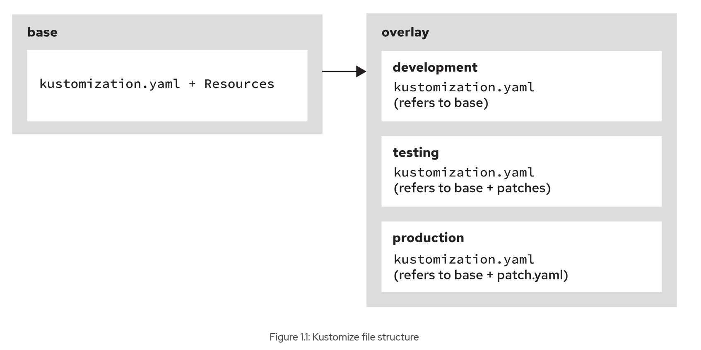

# Kustomize Overlays

## Objectives
* Deploy and update applications from resource manifests that are augmented by Kustomize.

## Kustomize

Kustomize is a configuration management tool to make declarative changes to application configurations and components and 
preserve the original base YAML files. Kubernetes resources that constitute your application are grouped into a directory, 
and then Kustomize is used to copy and adapt these resource files to your environments and clusters. 

The kubectl command integrates the kustomization tool.

## Kustomize File Structure

Kustomize works on directories that contain a kustomization.yaml file at the root. 

Kustomize supports compositions and customization of different resources such as deployment, service, and secret. 
You can use patches to apply customization to different resources. 

Kustomize has the concept of a base, and overlays.

Base
A base directory contains a kustomization.yaml file. The kustomization.yaml file has a list resource field to include all 
resource files. 

As the name implies, all resources in the base directory are a common resource set. You can create a base application by 
composing all common resources from the base directory.

The following diagram shows the structure of a base directory:

```
base  
├── configmap.yaml  
├── deployment.yaml  
├── secret.yaml  
├── service.yaml  
├── route.yaml  
└── kustomization.yaml  
```

The base directory has YAML files to create configuration map, deployment, service, secret, and route resources. 
The base directory also has a kustomization.yaml file, such as the following example:

```
apiVersion: kustomize.config.k8s.io/v1beta1
kind: Kustomization
resources:
- configmap.yaml
- deployment.yaml
- secret.yaml
- service.yaml
- route.yaml
```

The kustomization.yaml file lists all resource files.

## Overlays

Kustomize overlays are declarative YAML artifacts, or patches, that override the general settings without modifying the 
original files. 

The kustomization.yaml file can refer to one or more directories as bases. Multiple overlays can use a common base kustomization directory.

The following diagram shows the structure of all Kustomize directories:



```
$ tree
base
├── configmap.yaml
├── deployment.yaml
├── secret.yaml
├── service.yaml
├── route.yaml
└── kustomization.yaml
overlay
└── development
    └── kustomization.yaml
└── testing
    └── kustomization.yaml
└── production
    ├── kustomization.yaml
    └── patch.yaml
```

The following example shows a kustomization.yaml file in the overlays/development directory:

```
apiVersion: kustomize.config.k8s.io/v1beta1
kind: Kustomization
namespace: dev-env
bases:
- ../../base
```

The frontend-app/overlay/development/kustomization.yaml file uses the base kustomization file at ../../base to create all 
the application resources in the dev-env namespace.

Kustomize provides fields to set values for all resources in the kustomization file:

|Field	           |Description |
|----------------- |----------------------------------------------- |
|namespace	       |Set a specific namespace for all resources.     |
|namePrefix	       |Add a prefix to the name of all resources.      |
|nameSuffix	       |Add a suffix to the name of all resources.      |
|commonLabels      |Add labels to all resources and selectors.      |
|commonAnnotations |Add annotations to all resources and selectors. |

You can customize for multiple environments by using overlays and patching. 

The patches mechanism has two elements: patch and target.

Previously, Kustomize used the PatchesJson6902 and PatchesStrategicMerge keys to add resource patches. These keys are deprecated 
in Kustomize version 5 and are replaced with a single key. However, the content of the patches key continues to use the same patch formats.

You can use JSON Patch and strategic merge patches. See the references section for further information about both patch formats.

The following is an example of a kustomization.yaml file in the overlays/testing directory:

```
apiVersion: kustomize.config.k8s.io/v1beta1
kind: Kustomization
namespace: test-env
patches:
- patch: |-
    - op: replace
      path: /metadata/name
      value: frontend-test
  target:
    kind: Deployment
    name: frontend
- patch: |-
    - op: replace
      path: /spec/replicas
      value: 15
  target:
    kind: Deployment
    name: frontend
bases:
- ../../base
commonLabels:
  env: test
```

The patches mechanism also provides an option to include patches from a separate YAML file by using the path key.

The following example shows a kustomization.yaml file that uses a patch.yaml file:

```
apiVersion: kustomize.config.k8s.io/v1beta1
kind: Kustomization
namespace: prod-env
patches:
- path: patch.yaml
  target:
    kind: Deployment
    name: frontend
  options:
    allowNameChange: true
bases:
- ../../base
commonLabels:
  env: prod
```

The patch.yaml file has the following content:

```
apiVersion: apps/v1
kind: Deployment
metadata:
  name: frontend-prod
spec:
  replicas: 5
```

## View and Deploy Resources by Using Kustomize

Run the *kubectl kustomize <kustomization-directory>* command to render the manifests without applying them to the cluster:

```
$ kubectl kustomize overlay/production

...output omitted...
kind: Deployment
metadata:
  labels:
    app: frontend
    env: prod
  name: frontend-prod
...output omitted...
spec:
  replicas: 5
  selector:
    matchLabels:
      app: frontend
      env: prod
...output omitted...
```

The kubectl apply command applies configurations to the resources in the cluster. If resources are not available, then the 
kubectl apply command creates resources. 

The kubectl apply command applies a kustomization with the -k flag.

```
$ kubectl apply -k overlay/production

deployment.apps/frontend-prod created
...output omitted...
```

## Delete Resources by Using Kustomize

Run the *oc delete kustomize <kustomization-directory>* command to delete the resources that were deployed by using Kustomize.

```
$ oc delete kustomize overlay/production

configmap "database" deleted
secret "database" deleted
service "database" deleted
deployment.apps "database" deleted
```

## Kustomize Generators

Configuration maps hold non-confidential data by using a key-value pair. Secrets are similar to configuration maps, but 
secrets hold confidential information such as usernames and passwords. 

Kustomize has *configMapGenerator* and *secretGenerator* fields that generate configuration map and secret resources.

The configuration map and secret generators can include content from external files in the generated resources. 

By keeping the content of the generated resources outside the resource definitions, you can use files that other tools generated, 
or that are stored in different systems. 

Generators help to manage the content of configuration maps and secrets, by taking care of encoding and including content from other sources.

### Configuration Map Generator

Kustomize provides a configMapGenerator field to create a configuration map. The configuration map that a configMapGenerator 
field creates behaves differently. In this method, Kustomize appends a hash to the name, and any change in the configuration 
map triggers a rolling update.

The following example adds a configuration map by using the configMapGenerator field in the staging kustomization file. 
The hello application deployment has two environment variables to refer to the hello-app-configmap configuration map.

The kustomization.yaml file has the following content:

```
apiVersion: kustomize.config.k8s.io/v1beta1
kind: Kustomization
namespace: hello-stage
bases:
- ../../base
configMapGenerator:
- name: hello-app-configmap
  literals:
    - msg="Welcome!"
    - enable="true"
```

The deployment.yaml file has the following content:

```
apiVersion: apps/v1
kind: Deployment
metadata:
  name: hello
  labels:
    app: hello
    name: hello
spec:
...output omitted...
    spec:
      containers:
      - name: hello
        image: quay.io/hello-app:v1.0
        env:
        - name: MY_MESSAGE
          valueFrom:
            configMapKeyRef:
              name: hello-app-configmap
              key: msg
        - name: MSG_ENABLE
          valueFrom:
            configMapKeyRef:
              name: hello-app-configmap
              key: enable
```

You can view and deploy all resources and customizations that the kustomization YAML file defines, in the development directory:

```
$ kubectl kustomize overlays/staging

apiVersion: v1
data:
  enable: "true"
  msg: Welcome!
kind: ConfigMap
metadata:
  name: hello-app-configmap-9tcmf95d77
  namespace: hello-stage
---
apiVersion: apps/v1
kind: Deployment
metadata:
  labels:
    app: hello
    name: hello
  name: hello
  namespace: hello-stage
spec:
...output omitted...
    spec:
      containers:
      - env:
        - name: MY_MESSAGE
          valueFrom:
            configMapKeyRef:
              key: msg
              name: hello-app-configmap-9tcmf95d77
        - name: MSG_ENABLE
          valueFrom:
            configMapKeyRef:
              key: enable
              name: hello-app-configmap-9tcmf95d77
...output omitted...
```

```
$ kubectl apply -k overlays/staging

configmap/hello-app-configmap-9tcmf95d77 created
deployment.apps/hello created
```

```
$ oc get all

NAME                         READY   STATUS    RESTARTS   AGE
pod/hello-75dc9cfc87-jh62k   1/1     Running   0          97s

NAME                    READY   UP-TO-DATE   AVAILABLE   AGE
deployment.apps/hello   1/1     1            1           97s

NAME                               DESIRED   CURRENT   READY   AGE
replicaset.apps/hello-75dc9cfc87   1         1         1       97s
```

The kubectl apply -k command creates a hello-app-configmap-9tcmf95d77 configuration map and a hello deployment. Update the 
kustomization.yaml file with the configuration map values:

```
apiVersion: kustomize.config.k8s.io/v1beta1
kind: Kustomization
namespace: hello-stage
bases:
- ../../base
configMapGenerator:
- name: hello-app-configmap
  literals:
    - msg="Welcome Back!"
    - enable="true"
```

Then, apply the overlay with the kubectl apply command:

```
$ kubectl apply -k overlays/staging

configmap/hello-app-configmap-696dm8h728 created
deployment.apps/hello configured
```

```
$ oc get all

NAME                        READY   STATUS    RESTARTS   AGE
pod/hello-55bc55ff9-hrszh   1/1     Running   0          3s

NAME                    READY   UP-TO-DATE   AVAILABLE   AGE
deployment.apps/hello   1/1     1            1           5m5s

NAME                               DESIRED   CURRENT   READY   AGE
replicaset.apps/hello-55bc55ff9    1         1         1       3s
replicaset.apps/hello-75dc9cfc87   0         0         0       5m5s
```

The kubectl apply -k command applies kustomization. Kustomize appends a new hash to the configuration map name, which creates 
a hello-app-configmap-696dm8h728 configuration map. The new configuration map triggers the generation of a new hello-55bc55ff9-hrszh pod.

You can generate a configuration map by using the files key from the .properties file or from the .env file by using the 
envs key with the file name as the value. You can also create a configuration map from a literal key-value pair by using 
the literals key.

The following example shows a kustomization.yaml file with the configMapGenerator field:

```
...output omitted...
configMapGenerator:
- name: configmap-1 
  files:
    - application.properties
- name: configmap-2 
  envs:
    - configmap-2.env
- name: configmap-3 
  literals:
    - name="configmap-3"
    - description="literal key-value pair"
```

The following example shows the application.properties file that is referenced in the configmap-1 key:

```
Day=Monday
Enable=True
```

The following example shows the configmap-2.env file that is referenced in the configmap-2 key:

```
Greet=Welcome
Enable=True
```

Run the kubectl kustomize command to view details of resources and customizations that the kustomization YAML file defines:

```
$ kubectl kustomize .

apiVersion: v1
data:
  application.properties: |
    Day=Monday
    Enable=True
kind: ConfigMap
metadata:
  name: configmap-1-5g2mh569b5
---
apiVersion: v1
data:
  Enable: "True"
  Greet: Welcome
kind: ConfigMap
metadata:
  name: configmap-2-92m84tg9kt
---
apiVersion: v1
data:
  description: literal key-value pair
  name: configmap-3
kind: ConfigMap
metadata:
  name: configmap-3-k7g7d5bffd
---
...output omitted...
```

The configmap-3-k7g7d5bffd configuration map is generated from a literal key-value pair.

### Secret Generator

A secret resource has sensitive data such as a username and a password. You can generate the secret by using the secretGenerator 
field. 

The secretGenerator field works similarly to the configMapGenerator field. However, the secretGenerator field also 
performs the base64 encoding that secret resources require.

The following example shows a kustomization.yaml file with the secretGenerator field:

```
...output omitted...
secretGenerator:
- name: secret-1 
  files:
    - password.txt
- name: secret-2 
  envs:
    - secret-mysql.env
- name: secret-3 
  literals:
    - MYSQL_DB=mysql
    - MYSQL_PASS=root
```

### Generator Options

Kustomize provides a *generatorOptions* field to alter the default behavior of Kustomize generators. 

The configMapGenerator and secretGenerator fields append a hash suffix to the name of the generated resources.

Workload resources such as deployments do not detect any content changes to configuration maps and secrets. **Any changes 
to a configuration map or secret do not apply automatically.**

Because the generators append a hash, when you update the configuration map or secret, the resource name changes. This change triggers a rollout.

In some cases, the hash is not needed. Some operators observe the contents of the configuration maps and secrets that they 
use, and apply changes immediately. For example, the OpenShift OAuth operator applies changes to htpasswd secrets automatically. 
You can disable this feature with the generatorOptions field.

You can also add labels and annotations to the generated resources by using the generatorOptions field.

The following example shows the use of the generatorOptions field:

```
...output omitted...
configMapGenerator:
- name: my-configmap
  literals:
    - name="configmap-3"
    - description="literal key-value pair"
generatorOptions:
  disableNameSuffixHash: true
  labels:
    type: generated-disabled-suffix
  annotations:
    note: generated-disabled-suffix
```

You can use the kubectl kustomize command to render the changes to verify their effect:

```
$ kubectl kustomize .

apiVersion: v1
data:
  description: literal key-value pair
  name: configmap-3
kind: ConfigMap
metadata:
  annotations:
    note: generated-disabled-suffix
  labels:
    type: generated-disabled-suffix
  name: my-configmap
```

The my-configmap configuration map is without a hash suffix, and has a label and annotations that are defined in the kustomization file.